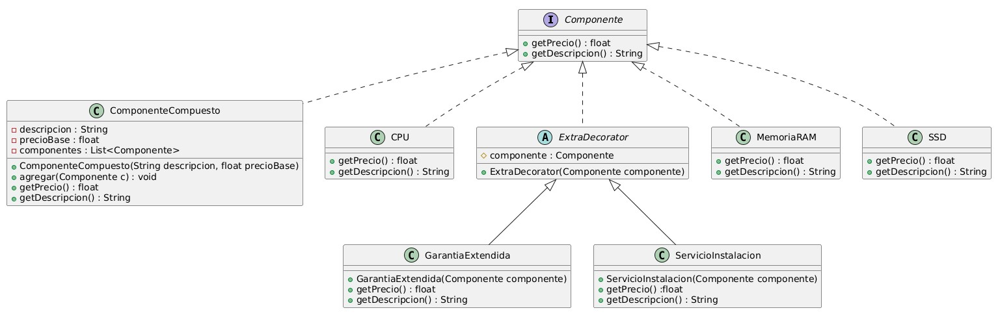

# Escenario 1: Sistema de Ensamblaje de Computadoras

## Análisis del Escenario 1
- **Clases principales:** `Componente`, `CPU`, `MemoriaRAM`, `SSD`, `Gabinete`, `PlacaMadre`, `ExtraDecorator`
- **Problemas:**
    - Necesidad de tratar componentes simples y compuestos de forma uniforme.
    - Agregar funcionalidades (extras) sin alterar las clases base.
    - Flexibilidad para combinar extras.

## Identificación de patrones
- **Composite:** Para tratar componentes simples y compuestos de forma uniforme. Composite permite que `Gabinete` y `SSD` se traten igual desde el punto de vista del cliente, facilitando el cálculo del precio total.
- **Decorator:** Para añadir funcionalidades (extras) dinámicamente. Decorator permite añadir `GarantíaExtendida` y `ServicioInstalación` sin modificar las clases base, manteniendo la apertura para extensión y el cierre para modificación.

## Diagrama de clases (PlantUML)


```plantuml
@startuml
interface Componente {
    +getPrecio() : float
    +getDescripcion() : String
}

class ComponenteCompuesto {
    -descripcion : String
    -precioBase : float
    -componentes : List<Componente>
    +ComponenteCompuesto(String descripcion, float precioBase)
    +agregar(Componente c) : void
    +getPrecio() : float
    +getDescripcion() : String
}

class CPU {
    +getPrecio() : float
    +getDescripcion() : String
}

abstract class ExtraDecorator {
    #componente : Componente
    +ExtraDecorator(Componente componente)
}

class GarantiaExtendida {
    +GarantiaExtendida(Componente componente)
    +getPrecio() : float
    +getDescripcion() : String
}

class MemoriaRAM {
    +getPrecio() : float
    +getDescripcion() : String
}

class ServicioInstalacion {
    +ServicioInstalacion(Componente componente)
    +getPrecio() :float
    +getDescripcion() : String
}

class SSD {
    +getPrecio() : float
    +getDescripcion() : String
}

Componente <|.. CPU
Componente <|.. MemoriaRAM
Componente <|.. SSD
Componente <|.. ComponenteCompuesto
Componente <|.. ExtraDecorator
ExtraDecorator <|-- GarantiaExtendida
ExtraDecorator <|-- ServicioInstalacion

@enduml