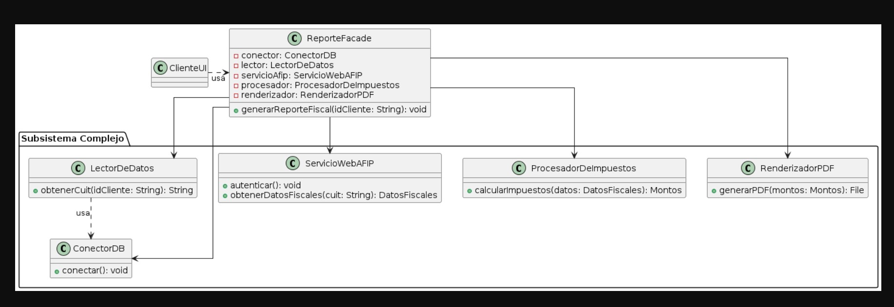

# Escenario 2: Módulo de Generación de Reportes

## Análisis del Escenario 1
### Clases principales
- **ConectorDB**: maneja la conexión a la base de datos.
- **LectorDeDatos**: obtiene datos del cliente desde la base de datos.
- **ServicioWebAFIP**: comunica con los servicios externos de AFIP para obtener datos fiscales.
- **ProcesadorDeImpuestos**: calcula montos e impuestos a partir de los datos fiscales.
- **RenderizadorPDF**: genera el documento PDF final con los montos calculados.

### Cliente
El cliente es el programador o la capa de Interfaz de Usuario que necesita generar el reporte fiscal.

### Problemas identificados
- **Alta complejidad**: el cliente debe orquestar una secuencia de 5–6 pasos para generar un solo reporte, lo que dificulta su uso y mantenimiento.  
- **Fuerte acoplamiento**: el cliente está acoplado a múltiples clases del subsistema; cualquier cambio en ellas obliga a modificar al cliente.  
- **Violación del Principio de Menor Conocimiento (Ley de Demeter)**: el cliente conoce detalles internos del subsistema de reportes en lugar de interactuar con una interfaz simplificada.

## Identificación de patrones
### Patrón identificado: Facade

**Descripción:** El subsistema es complejo y requiere una interfaz simplificada para que el cliente pueda generar reportes sin conocer los detalles internos.

**Intención:** Proporcionar una interfaz unificada y sencilla que encapsule la orquestación entre múltiples clases del subsistema.

**Por qué es la elección ideal**
- Oculta la complejidad: toda la secuencia de pasos (conexión, lectura, consulta a AFIP, cálculo y renderizado) se encapsula dentro de la fachada, liberando al cliente de la lógica interna.  
- Reduce el acoplamiento: el cliente deja de depender de varias clases del subsistema y pasa a interactuar solo con la clase `ReporteFacade`.  
- Simplifica el uso: el cliente realiza una única llamada, por ejemplo `reporteFacade.generarReporteFiscal(idCliente)`, y la fachada se encarga de la orquestación interna.
- Mejora mantenibilidad y cumplimiento de la Ley de Demeter al ofrecer una interfaz de alto nivel y estable.

## Diagrama de clases  
